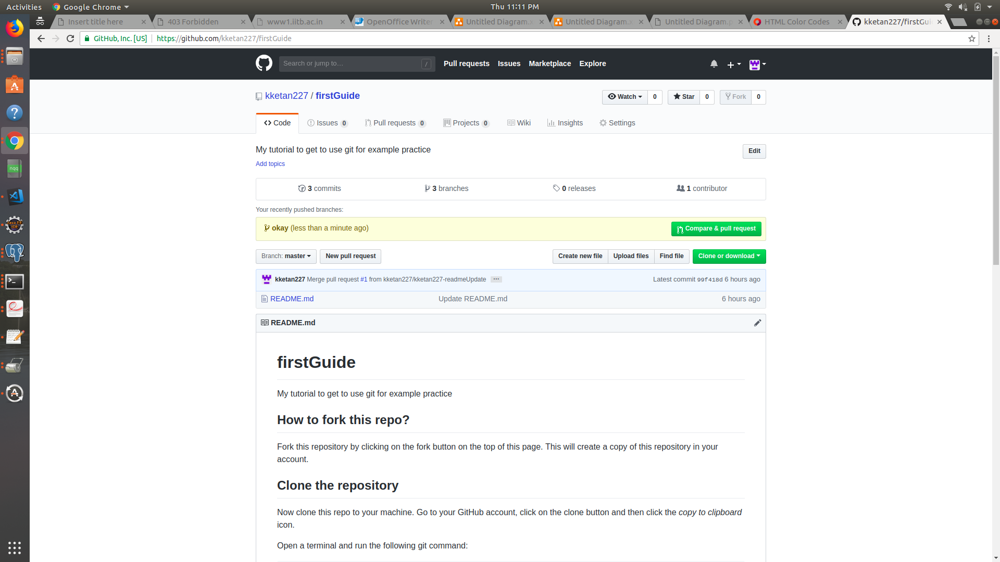
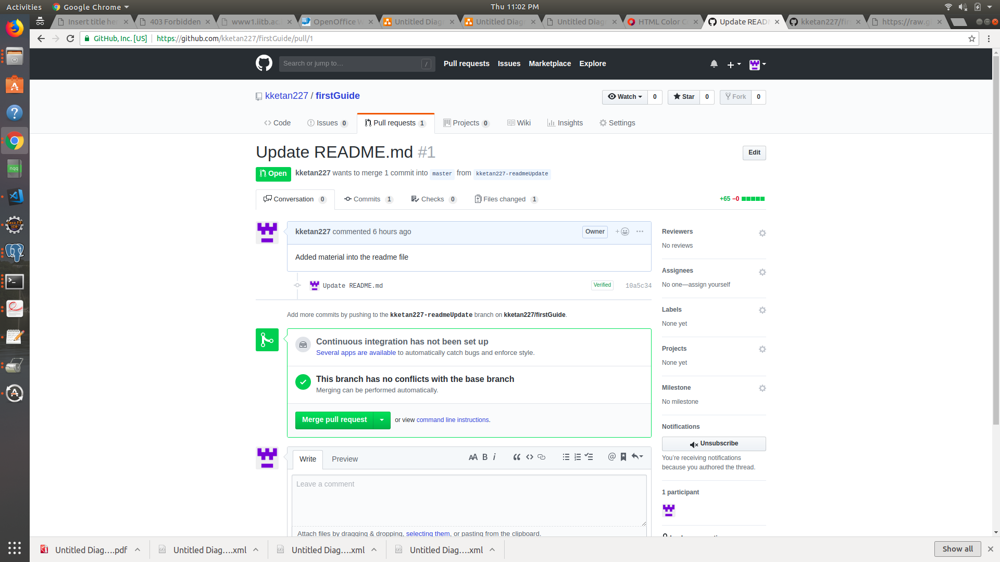

# firstGuide
My tutorial to get to use git for example practice

## How to fork this repo?

Fork this repository by clicking on the fork button on the top of this page. This will create a copy of this repository in your account.

## Clone the repository

Now clone this repo to your machine. Go to your GitHub account, click on the clone button and then click the *copy to clipboard* icon.

Open a terminal and run the following git command:

```
git clone "url you just copied"
```
where "url you just copied" (without the quote marks) is the url to this repository(your fork of this project).

Now this would have by now created a copy of this on your local machine.

## Create a branch

Change to the repository directory on your computer (if you are not already there):

```
cd firstGuide
```
Now create a branch using the `git checkout` command:
```
git checkout -b <add-your-new-branch-name>
```

## Make necessary changes and commit those changes

Make whatever changes to any of the files and update in the log for a record across the users. Not actually required you'll discover this.
Consider maybe adding your name to this as a first exercise if you don't get an idea for what changes to make...


If you go to the project directory and execute the command `git status`, you'll see there are changes. But the files are untracked so to start tracking them in this branch, add those files. 


Add those changes to the branch you just created using the `git add` command:

```
git add <file-names>
```
This kinda keeps a check on whether you want those changes to get reflected onto your branch. Let's take a scenario you wanted to experimentally try a feature and decided no and wanted to dump it this kinda keeps a buffer for stuff like that.


Now commit those changes using the `git commit` command:
```
git commit -m "<your message here as to what changes have you committed for what changes for a reference"
```
This now makes your files ready for upload in scenarios you aren't in a condition to connect to the internet. It is in such a a state that on internet access running the below commands would sync this up on your GitHub check below...


## Push changes to GitHub

Push your changes using the command `git push`:
```
git push origin <add-your-branch-name>
```
replacing `<add-your-branch-name>` with the name of the branch you created earlier.


## Creating a pull request ie. submitting your changes for review

If you now open your repository on GitHub, you'll see a  `Compare & pull request` button.  Click on that button.



Now submit the pull request.


## Delete the branch after pull request has been merged

You can safely delete your branch '<add-your-branch-name>' after the pull request has been merged. You'll see a button to delete the branch:


If the Pull Request was closed without being merged, GitHub will warn you about deleting unmerged commits.

## Also the merging end looks like

The merging end of the repo, the look enjoyed by the master is shown in the picture here you can see the changes and also the comments to it and then decide if you'd like to pull these changes and merge it into the repo and update the master




#### Don't worry about the .md file this is like a text file with perks of attaching images like html which can be viewed well in the browser or especially on GitHub

## Cheers!


### Ketan Karnakota
